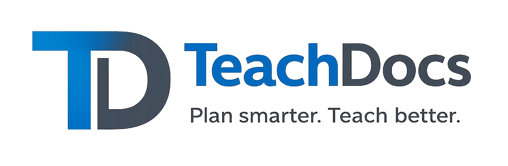

# TeachDocs — Smart Teaching & Lesson Planning Toolkit

<p align="center">
  
</p>

<p align="center">
  <em>
    A workflow tool helping teachers turn curriculum into effective classroom practice.
  </em>
</p>

## Backend REST API Setup

### Installation

Install the dependencies

```bash
$ cd api
$ npm install
```

Copy environment variables

```bash
$ cp .env.example .env
```

### Database & Prisma

To apply database migrations, run:

```bash
$ npx prisma migrate dev
```

`NB:` Make sure PostgreSQl is installed and running.

To generate Prisma Client, run:

```bash
$ npx prisma generate
```

### Development

To start a local development server, run:

```bash
$ npm run start:dev
```

### Building

To build the project run:

```bash
$ npm run build
```

### Running unit tests

For unit testing, run:

```bash
$ npm run test
```

### Running end-to-end tests

For end-to-end (e2e) testing, run:

```bash
$ npm run test:e2e
```
